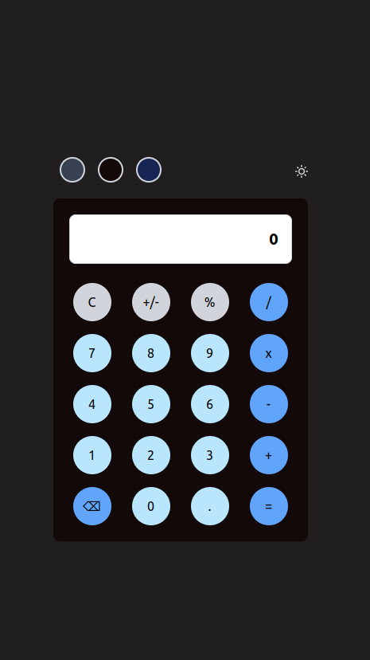
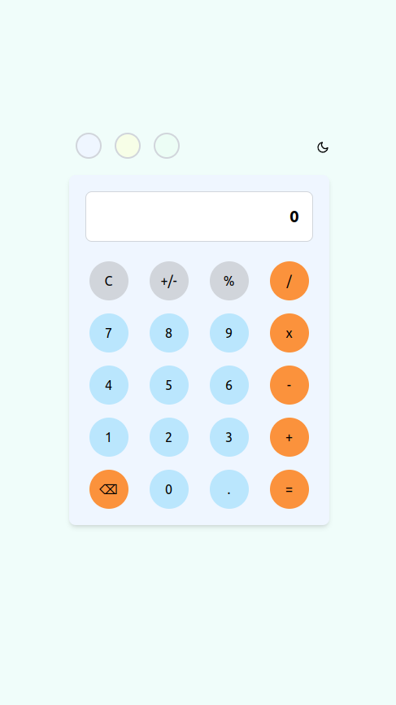

# Calculator App

This is a simple calculator app built with React.

## Features

- Basic arithmetic operations: addition, subtraction, multiplication, division
- Clear, delete, and percentage functionalities
- Dark mode and light mode
- 6 theme customization options 3 for darkMode 3 for lightMode

## Demo

[Live Demo](https://calculator-phi-black.vercel.app/)

## Technologies Used

- React
- TypeScript
- Tailwind CSS

## Screenshots

## Getting Started

1. Clone the repository
2. Install dependencies: `npm install or npm i`
3. Run the app: `npm run dev`

## Contributing

Contributions are welcome! Feel free to submit pull requests.
